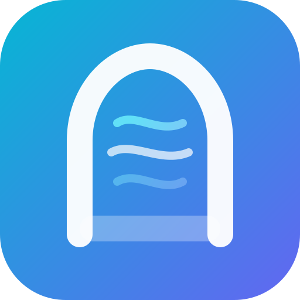

<div align="center">
  

  <h1>AirGate Core</h1>

  <p><strong>轻量单体 AI 网关：多渠道调度 · 原生协议透传 · 价目表计费</strong></p>

  <p>
    <a href="https://github.com/DouDOU-start/airgate-core/releases"></a>
    <a href="https://github.com/DouDOU-start/airgate-core/pkgs/container/airgate-core"></a>
    <a href="https://github.com/DouDOU-start/airgate-core/blob/master/LICENSE"></a>
    
    
  </p>
</div>

---

AirGate Core 是一个**自包含的单体 AI 网关**：管理员配置**渠道**（协议类型 + base_url + 上游 api_keys + 模型列表），用户拿 `sk-` 密钥按原生协议调用对应端点，网关**零翻译纯透传**直发上游，并按**模型价目表**精确计费。

普通同协议渠道继续遵循上面的零翻译契约。平台字段为 `codex` 的账号是一个显式的双平面例外：官方 Codex 原生端点走 `codex_executor.v1` 插件，明确要求跨协议的入口则走 Core 内置的 CPA 翻译桥；安装增强插件不会关闭 Codex 账号的 CPA 能力。其他账号平台不受该插件策略影响。

- **单二进制部署**：前端 SPA、翻译文件全部 `go:embed` 内嵌，外部依赖只有 PostgreSQL 17 与 Redis 8
- **零翻译**：请求/响应体原样透传，不做任何跨协议转换——上游行为即最终行为
- **多渠道调度**：渠道与订阅账号按优先级分档 + 权重随机，失败自动 failover（≤3 次）；限流账号恢复探测单飞、单请求至多一次，失败后指数冷却并保留健康 Core fallback
- **自动养护**：429/5xx 自动换渠道、401/402/403 自动禁用，全程留痕可排障

## 支持的入站协议

入站端点按协议分树，只路由到同协议渠道：

| 协议 | 端点 | 匹配渠道类型 |
|---|---|---|
| OpenAI | `POST /v1/chat/completions` · `/v1/responses` · `/v1/images/generations` · `/v1/images/edits` · `GET /v1/models` | `openai_compatible` / `custom` |
| Anthropic | `POST /v1/messages` · `/v1/messages/count_tokens` | `anthropic` |
| Gemini | `POST /v1beta/models/{model}:generateContent` 等 · `GET /v1beta/models` | `gemini` |
| OpenAI 视频（异步任务） | `POST /v1/videos` · `GET /v1/videos/{id}` · `GET /v1/videos/{id}/content` | `openai_video` |
| Suno 音乐（异步任务） | `POST /suno/submit/{music\|lyrics}` · `POST /suno/fetch` · `GET /suno/fetch/{id}` | `suno` |

SSE 流式全协议支持；`count_tokens` 两端点零计费。

异步任务（视频/音乐）为「提交-轮询」模型：提交时按估价**预扣**余额（按次价或
`pricing_extra.video.per_second` 按秒价 × 时长），后台每 10s 轮询上游刷新状态，
成功按实际用量**差额多退少补**并落用量日志，失败/超时（默认 30 分钟，
`task_timeout_minutes` 可调）**全额退款**。任务查询读本地快照，不穿透上游；
Suno 的计费模型名由动作合成（`suno_music` / `suno_lyrics`），渠道模型列表与价目表需配置这两个名字。

## 功能一览

- **渠道管理**：多渠道多 key、优先级/权重、渠道测试、余额刷新、上游模型拉取、批量操作、失败统计
- **计费**：模型价目表（token 单价 / 按次计价 / 视频按秒计价）+ 三管道计费（实扣 / 账面 / 渠道成本），倍率按「用户专属 > 用户等级 > 分组档位」优先级解析（等级 = 按等级×分组批量分层定价）；密钥可设最高计费倍率，实际倍率超限时预检拒绝请求（防调价后超预期消费）
- **异步任务**：视频（Sora 形态 `/v1/videos`）与 Suno 音乐的提交-轮询转发，预扣-结算-退款三段式计费
- **用户体系**：注册（邮箱验证码）/ 登录 / API Key 自助管理 / 余额预警 / 用量明细与趋势
- **分组**：渠道按分组隔离，用户按分组授权，倍率可按组覆盖
- **充值**：易支付等支付渠道、兑换码
- **OAuth 提供方**：标准 PKCE 授权码流程，供外部应用接入（`/oauth/token`、`/oauth/userinfo`、`/oauth/provision-key`）；支持 scope 约束的共享钱包查询、幂等扣款和关联退款（`/oauth/wallet/*`）
- **运维**：管理仪表盘、上游请求留痕、公告系统、后台一键自更新（systemd/Docker 感知）
- **渠道健康告警**：探针状态变化（暂停/恢复/可选降级）经 [Bark](https://github.com/Finb/Bark) 推送到管理员 iPhone，支持官方/自建 server 与 Device Key
- **限流**：用户/密钥/渠道三级并发闸门 + RPM 限速（Redis 原语）；上游账号 429 冷却期间不会被插件持续强制调度
- **风控中心**：转发前内容审核（关键词 Aho-Corasick 拦截 + 外部审核 API 多 key 轮询熔断 + 命中哈希缓存），observe/pre_block 双模式，采样率/分组/模型过滤，滑窗违规计数自动封禁（管理员豁免）+ 邮件通知，审核日志双保留期 TTL 清理
- **可插拔插件运行时**：基于 `hashicorp/go-plugin + gRPC` 的多实例独立进程；插件以类型和能力声明接入点，管理后台支持上传或 URL 安装、YAML 配置、独立启停、重载与卸载

## Codex 双平面：官方原生转发与 CPA 翻译

原生线协议以 [OpenAI Codex CLI](https://github.com/openai/codex) 及其 [WebSocket Mode 文档](https://developers.openai.com/api/docs/guides/websocket-mode)、[Codex 配置参考](https://developers.openai.com/codex/config-reference) 为兼容基线；具体可用模型和账号权限仍由上游账号决定。

Codex 账号（平台字段严格为 `codex`，匹配时忽略大小写与首尾空白）可以同时使用两条传输平面。`codex_mode` 仅作为插件级统一配置，对所有 Codex 账号生效；账号凭证不配置传输模式。未配置插件策略时默认为 `auto`。账号级传输模式字段不参与路由，也不提供兼容读取。`openai`、`openai-codex`、`openai_codex` 以及其他平台不会被增强插件视作 Codex 账号，继续使用原有 CPA 或渠道逻辑。

`codex_mode` 不参与共享 `/v1/responses` 或 Images 入口的账号预选，也不会把 Codex 账号提升到 XAI/OpenAI 等账号之前。Core 仍按原有优先级、权重、会话粘性和健康状态选择账号；只有最终选中 canonical `codex` 账号后，才用该模式决定这个账号走原生插件还是 CPA。因此 Codex CLI 调度到 XAI/OpenAI CPA 账号时，账号行为保持不变，但客户端级 Instruction 注入仍可生效。

| `codex_mode` | 官方原生合同（Responses / compact / search） | 需要协议翻译的入口（Chat / Anthropic / Gemini / images） | 失败与回退 |
|---|---|---|---|
| `auto`（默认） | 优先原生插件 | 使用 CPA | Responses 在尚未产生上游输出、且不是实际 HTTP 4xx/5xx 时可回退 CPA；compact/search 没有 CPA 回退 |
| `native` | 与 `auto` 相同；选中 Codex 账号后优先原生插件 | 使用 CPA | 同上；不改变混合账号池的选择顺序 |
| `native_only` | 只使用原生插件，不回退 CPA | 入口本身没有官方原生合同，仍由 CPA 完成必要翻译 | 原生插件不可用、未实现或在输出前失败时直接失败关闭 |
| `cpa_translate` | 对有 CPA 合同的端点强制 CPA；compact/search 仍走原生 | 强制 CPA | CPA 失败不切回原生；无 CPA 合同的端点拒绝 |
| `cpa_only` | 不使用原生；仅对存在 CPA 合同的端点翻译 | 强制 CPA | compact、alpha search 以及其他未定义合同的端点直接失败关闭 |

`native_only` 的“only”只针对存在官方原生线协议的端点；例如 Anthropic Messages 没有 Codex 原生线格式，因此仍必须经过 CPA。反过来，`cpa_translate` 也不会把 `responses/compact` 或 `alpha/search` 伪装成普通 Responses 翻译请求。

### 官方 Codex 原生端点

原生平面由插件声明的 `codex_executor.v1` 执行，Core 负责鉴权、账号选择、并发/RPM、审计、usage 与计费。请求和响应数据保持原始字节（除必要的 HTTP hop-by-hop 头清理），插件不把原生协议改写成 Chat Completions。

| 能力 | Core 路径（同一逻辑端点的别名） | 传输语义 |
|---|---|---|
| Responses | `POST /v1/responses`、`/responses`、`/codex/v1/responses` | JSON 非流式或 SSE 流式原样转发 |
| Compact | `POST /v1/responses/compact`、`/responses/compact`、`/codex/v1/responses/compact` | 独立 unary JSON 合同；不会按普通 Responses SSE 解析，也没有 CPA 翻译 |
| Alpha Search | `POST /v1/alpha/search`、`/alpha/search`、`/codex/v1/alpha/search` | Codex CLI 内置联网搜索，原生非流式、按次计费；没有 CPA 翻译 |
| Responses WebSocket | 对上述 Responses 路径发 `GET` Upgrade | 首帧必须是 `response.create`；原生账号建立持久双工连接，文本/二进制/控制帧原样转发，并支持 `stream_id` 多 lane 与 `previous_response_id` 续接 |
| Codex 模型目录 | `GET /codex/v1/models`、`/codex/models` | 返回 Codex CLI 所需的 `{models:[...]}` 形状，并带 `ETag` / `X-Models-Etag` |

WebSocket 是原生能力，不会从 CPA 账号借用凭证伪装成原生账号。没有可用原生账号、插件能力或会话容量时，HTTP 握手返回 `426 Upgrade Required`，已升级连接以可重试关闭码结束，让官方 CLI 回退到 HTTP/SSE。

### Codex 账号的 CPA 翻译合同

CPA 翻译平面由 Core 内置的 CLIProxyAPI translator/executor 管理。它把入口协议转换为 Codex Responses（或对应的 token/image 合同），再把 Codex 响应转换回入口协议；翻译器缺失时会在发往上游前报错，不会把原始 Anthropic/Gemini/Chat JSON 静默透传到 Responses。

| 入口协议与端点 | CPA 目标 | 流式/计费说明 |
|---|---|---|
| OpenAI `POST /v1/chat/completions` | Codex Responses | 支持非流式与 SSE；按统一 usage 计费 |
| OpenAI `POST /v1/responses` | Codex Responses | 可用于 `cpa_translate` / `cpa_only`；响应按入口合同返回 |
| Anthropic `POST /v1/messages` | Codex Responses | 支持 Messages 非流式与流式 |
| Anthropic `POST /v1/messages/count_tokens` | Codex token-count 合同 | 返回 Anthropic 形状；零计费 |
| Gemini `:generateContent` / `:streamGenerateContent` | Codex Responses | 支持 Gemini 请求/响应与流式转换 |
| Gemini `:countTokens` | Codex token-count 合同 | 返回 Gemini `usageMetadata` 形状；零计费 |
| OpenAI `POST /v1/images/generations`、`/v1/images/edits` | CPA 专用 Codex image executor | 生图 JSON 与图片编辑 JSON/multipart 使用专用适配器，不走通用文本 translator |

Gemini Imagen 的 `:predict` 是图像模型专用合同，不是 Codex 文本 Responses 的 CPA 合同；Codex 账号不会将它静默转换成文本请求，`cpa_only` 下会明确失败关闭。其他非合同端点同样不会被误判为原生 Responses。

### 代理、凭证刷新与安全边界

- 账号级 `proxy_url` 同时作用于原生插件、CPA 上游请求和凭证刷新；支持 `http://`、`https://`、`socks5://`、`socks5h://`（可带代理认证）。原生 WebSocket 会将 `http/https` 上游转换为 `ws/wss`，并通过 HTTP CONNECT 或 SOCKS5 建立连接。
- OAuth 账号在凭证临近过期（默认 5 分钟）时主动刷新。优先使用带 `session_token` 的 ChatGPT session（默认 `https://chatgpt.com/api/auth/session`），失败且存在 refresh token 时再使用官方 JSON OAuth token endpoint（默认 `https://auth.openai.com/oauth/token`）；上游 401 只允许再刷新并重试一次。
- 刷新成功的 access/refresh/session/id token、过期时间、账号 ID、邮箱、套餐与 FedRAMP claim 由 Core 回写账号。刷新失败时仍有效的 access token可进行最后一次上游尝试；凭证缺失或已过期则在发送请求前失败关闭。WebSocket 在握手前刷新，并允许一次 401 握手重试。
- 客户端传入的 `Authorization`、API key、Cookie、代理认证等不会覆盖所选账号租约；原生插件只注入选中账号的认证头、`ChatGPT-Account-ID`、`Originator`/`User-Agent` 及必要的 FedRAMP 标记。审计事件会去除凭证和 hop-by-hop 头。
- 当前原生转发支持 OAuth Bearer、ChatGPT session 与 API-key 租约；不支持官方 Codex 的 Agent Identity（Ed25519/SSH 私钥、runtime/task ID 或动态 `AgentAssertion` 签名）。不会把普通 Bearer 当作 Agent Identity，也不会伪造或降级这类签名请求。

### Fail-closed 与增强插件的边界

- 原生插件在产生任何上游响应前不可用时，只有 `auto`/`native` 且端点存在 CPA 合同时才允许一次 CPA 回退；已经产生输出、收到真实 HTTP 4xx/5xx 或端点无翻译合同时不切换，避免重复扣费或协议错配。
- `native_only`、`cpa_only` 和缺失 CPA translator 都在明确边界上失败关闭；不会把 Gemini `predict`、Responses compact 或 Alpha Search 改造成另一种协议。
- 超额兼容与 Instruction 注入属于插件的可选 Relay Hook 增强，不是账号路由。增强超时、非法响应或请求体超限时按 `204` 跳过增强，由 Core 继续正常转发；这与传输平面的 fail-closed 策略相互独立。

## 快速开始

### Docker Compose（推荐）

```bash
mkdir airgate && cd airgate
curl -sSL https://raw.githubusercontent.com/DouDOU-start/airgate-core/standalone-gateway/deploy/docker-deploy.sh | bash
docker compose up -d
```

脚本会生成随机密钥写入 `.env`（权限 600），并准备好数据目录。数据库、Redis、上传文件和已安装插件都会持久化到部署目录下的 `data/`；升级镜像或重建容器不会丢失。启动后访问 `http://<host>:9517` 注册账号——第一个注册的账号会自动成为系统管理员。

### 裸金属（systemd）

```bash
curl -sSL https://raw.githubusercontent.com/DouDOU-start/airgate-core/standalone-gateway/deploy/install.sh | sudo bash
sudo systemctl enable --now airgate-core
```

需要已运行的 PostgreSQL 15+ 与 Redis 7+。参考 `backend/config.yaml.example` 创建 `/etc/airgate-core/config.yaml`（填入 DB/Redis 连接与 `jwt.secret`，也可用环境变量提供），启动后访问 `http://<host>:9517` 注册的第一个账号即系统管理员。

### 源码开发

```bash
git clone -b standalone-gateway https://github.com/DouDOU-start/airgate-core.git
cd airgate-core
make install   # 安装全部依赖（Go modules + pnpm + air + 首次前端构建）
make dev       # 前后端热重载
```

## 配置

配置优先级：环境变量 > `config.yaml`（路径由 `--config` 或 `CONFIG_PATH` 指定，默认 `./config.yaml`）。

| 环境变量 | 说明 | 默认 |
|---|---|---|
| `DB_HOST` / `DB_PORT` / `DB_USER` / `DB_PASSWORD` / `DB_NAME` / `DB_SSLMODE` | PostgreSQL 连接 | — |
| `REDIS_HOST` / `REDIS_PORT` / `REDIS_PASSWORD` / `REDIS_DB` | Redis 连接 | — |
| `JWT_SECRET` | 登录 token 签名密钥 | — |
| `API_KEY_SECRET` | 渠道/用户密钥 AES-256-GCM 加密密钥，hex ≥64 字符；留空使用内置默认密钥（生产建议配置随机值） | 内置默认 |
| `PORT` / `HOST` | 监听端口 / 地址 | `9517` / `0.0.0.0` |
| `GIN_MODE` | `release` / `debug` | `debug` |
| `LOG_LEVEL` / `LOG_FORMAT` | 日志级别 / 格式（`text`/`json`） | `info` / `text` |
| `PLUGINS_ENABLED` | 没有 `runtime.yaml` 的手工安装插件的兼容默认开关 | `false` |
| `PLUGINS_DIR` / `PLUGINS_HOOK_TIMEOUT_MS` | 插件目录 / Relay Hook 执行链总超时毫秒数 | `data/plugins` / `500` |

配置文件不存在时，连接信息可完全由环境变量提供（docker compose 场景）。首次启动后注册的第一个账号会自动成为系统管理员。

## 请求链路

```
客户端（sk- 密钥） → 鉴权/余额预检 → 内容审核预检（风控中心，可选） → 用户/密钥并发闸门
  → 渠道调度（协议过滤 + 优先级分档 + 权重随机 + 多 key 轮询）
  → 透传直发上游（失败 failover ≤3：429/5xx 换渠道 / 401·402·403 自动禁用）
  → usage 计量归一化 → 价目表计费 → 异步落账 usage_log（无计量 / 中断且无 token 不落库）
```

## 项目结构

```
airgate-core/
├── backend/
│   ├── cmd/server/          # 入口
│   ├── ent/schema/          # 数据模型（唯一事实源，改后 make ent）
│   └── internal/
│       ├── relay/           # 转发子系统：registry 调度 / adaptor 透传 / pipeline 主循环 / task 异步任务 / errfmt 错误形态 / pricing 价目 / outcome 判定
│       ├── billing/         # 三管道计费与异步记账
│       ├── scheduler/       # Redis 限流原语（并发闸门 / RPM）
│       ├── app/             # 领域服务（user / channel / group / usage / payment / ...）
│       ├── server/          # HTTP 层（dto / handler / middleware / router）
│       ├── infra/store/     # 数据访问（唯一 import ent 的层）
│       ├── auth/            # API Key 鉴权与加密
│       ├── moderation/      # 风控判定核心（输入抽取 / 关键词 / 审核 API 熔断 / worker 池 / 封禁副作用）
│       ├── pluginruntime/   # 多实例插件协议、能力驱动与文件系统管理
│       └── errlog/          # 上游失败留痕
├── web/                     # React 19 + Vite + TanStack Query + Tailwind
└── deploy/                  # Dockerfile / compose / install.sh / systemd unit
```

## 从旧版本升级（重要）

本版本移除了全部启动期兼容/迁移代码，只保留最新干净 schema，**存量库升级须手动迁移**：

1. **表结构**：启动时仅做非破坏性建表补列（`Schema.Create`）。存量库既有外键的 `ON DELETE` 行为、历史列回填（`billed_cost`、`used_quota_actual`、`key_hint`、`*_snapshot`）不再自动迁移，如需保持删除用户/渠道后的历史留存语义，请手动对齐最新 `ent/schema`。
2. **支付配置**：旧插件时代的明文/无 `enc:v1` 前缀支付配置不再自动规范化，装载时会跳过并告警，需在管理后台重新保存一次。

全新部署无需关心以上内容。

## 构建与自检

```bash
make help          # 查看全部命令
make ci            # 提交前自检：lint + test + ent 漂移检查 + build
make ent           # 改 ent/schema 后重新生成
make docker-build  # 本地构建镜像
```

## 许可证

见 [LICENSE](LICENSE)。
