# 插件 / SDK / Core 统一基线图

> 用途：给 `airgate-core / airgate-sdk / 插件仓库` 做对照与统一。
>
> 原则：图为主，文字最少。

## 1. 当前状态

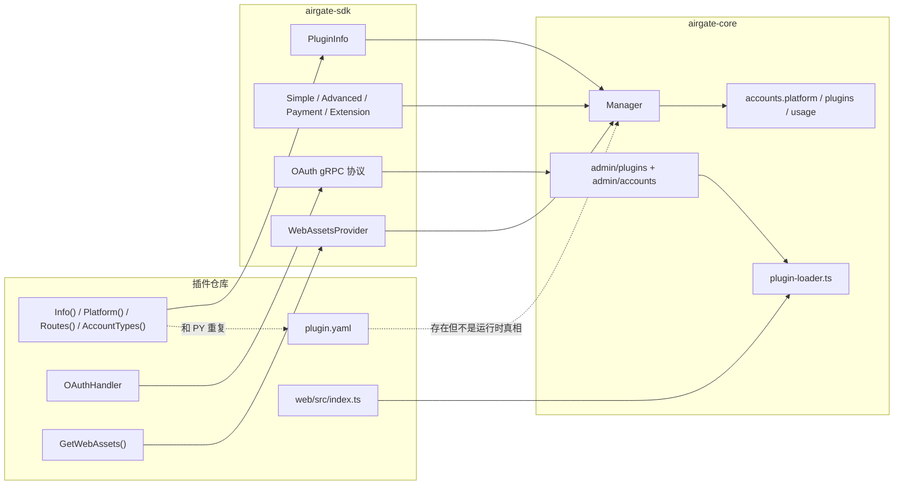

## 2. 当前主要分裂点

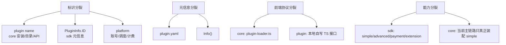

## 3. 统一目标

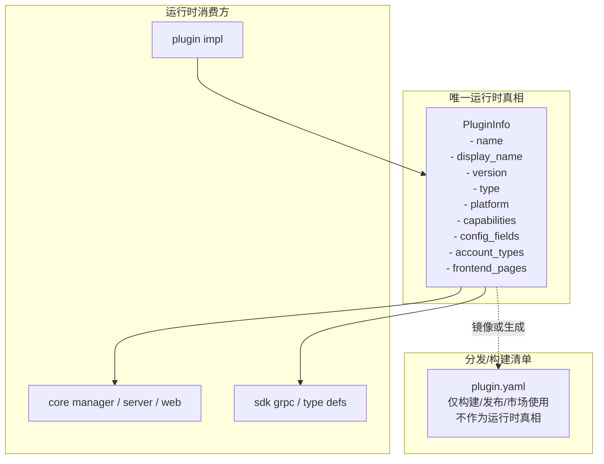

## 4. 标识职责

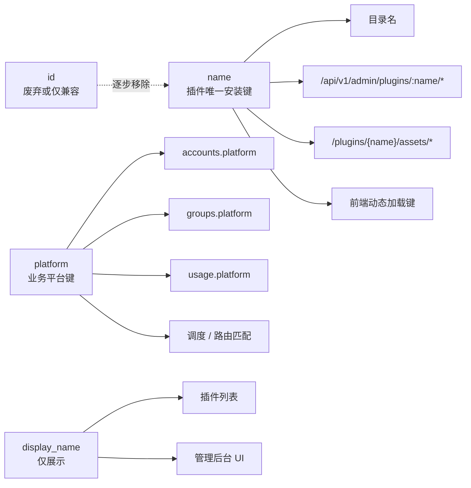

## 5. 后端统一链路

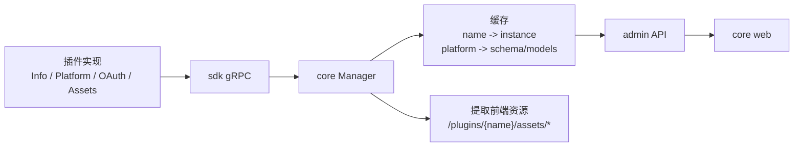

## 6. 前端插件协议

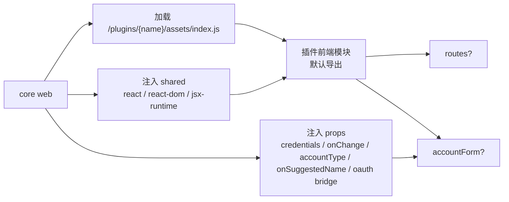

```ts
export interface PluginFrontendModule {
  routes?: Array<{ path: string; component: ComponentType }>;
  accountForm?: ComponentType<AccountFormProps>;
}
```

## 7. OAuth 边界

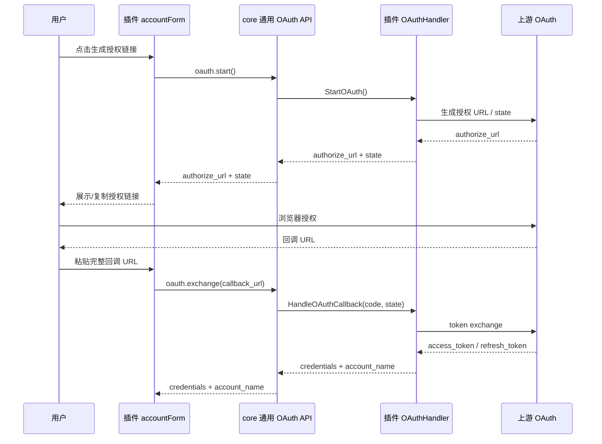

## 8. 账号 schema 统一目标

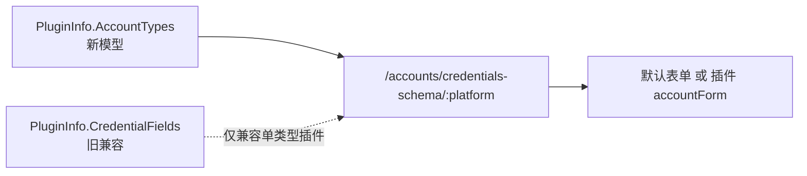

## 9. 插件类型支持边界

| 类型 | SDK | Core 当前 | 统一建议 |
| --- | --- | --- | --- |
| SimpleGateway | 有 | 已装配 | 正式支持 |
| AdvancedGateway | 有 | 未完整装配 | 暂不宣称正式支持 |
| Payment | 有 | 未完整装配 | 暂不宣称正式支持 |
| Extension | 有 | 未完整装配 | 暂不宣称正式支持 |

## 10. 落地顺序

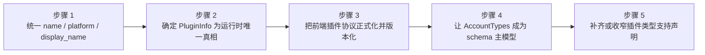

## 11. 本轮先收口（只动 Core）

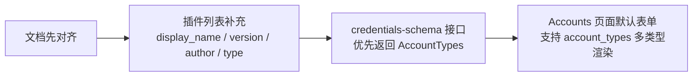

| 项目 | 本轮目标 |
| --- | --- |
| 插件元信息 | 让 `name` 和 `display_name` 在 core 管理端同时可见 |
| 默认账号表单 | 不再只认 `fields`，改为优先认 `account_types` |
| 兼容策略 | `fields` 继续保留，作为旧模型兼容输出 |

## 12. Core 统一策略

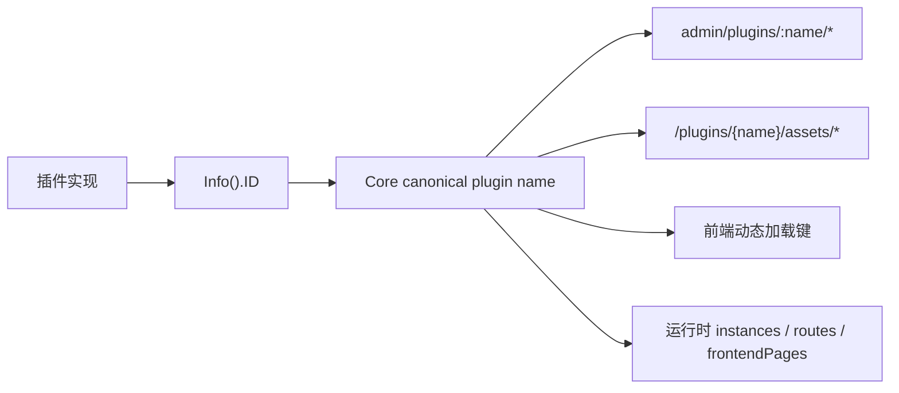

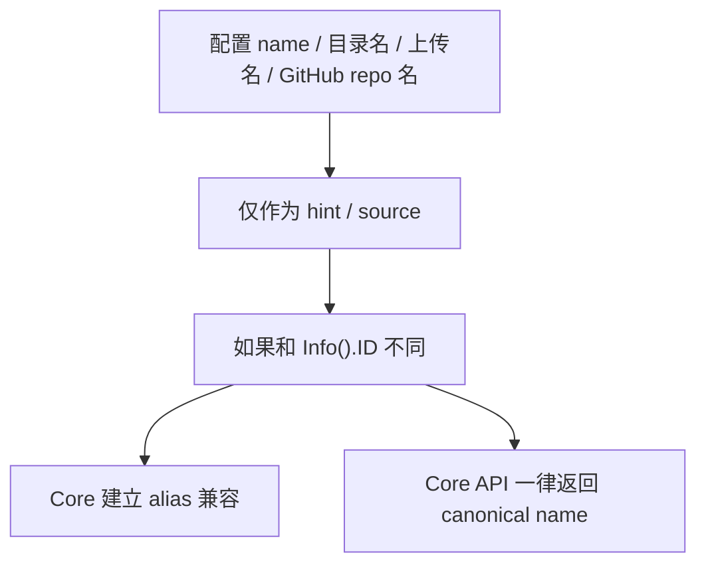

| 字段 | 角色 |
| --- | --- |
| `Info().ID` | Core 内部唯一 canonical plugin name |
| `platform` | 账号、调度、计费业务键 |
| `display_name` | UI 展示名 |
| `plugins.dev[].name` | 仅开发模式 hint，实际以 `Info().ID` 为准 |

## 13. 本轮代码目标

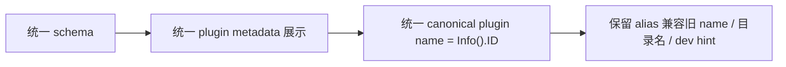

## 14. plugin.yaml 定位

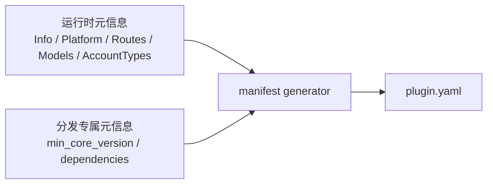

```mermaid
flowchart LR
    A["Core 运行时"] -.不读取 plugin.yaml 作为真相.-> D["plugin.yaml"]
    B["插件开发者"] --> C["改运行时代码"]
    C --> D
```

| 项 | 规则 |
| --- | --- |
| 运行时真相 | `Info().ID / Name / Version / Type`、`Platform()`、`Routes()`、`Models()`、`AccountTypes()` |
| 分发产物 | `plugin.yaml` |
| 生成方式 | `plugin.yaml` 由 generator 从运行时元信息生成 |
| 允许手写的字段 | 仅分发专属字段，如 `min_core_version`、`dependencies` |

## 15. SDK / 插件仓库落地规范

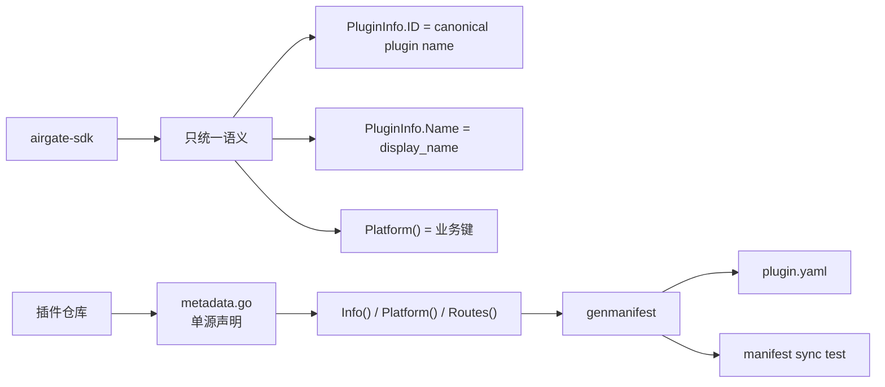

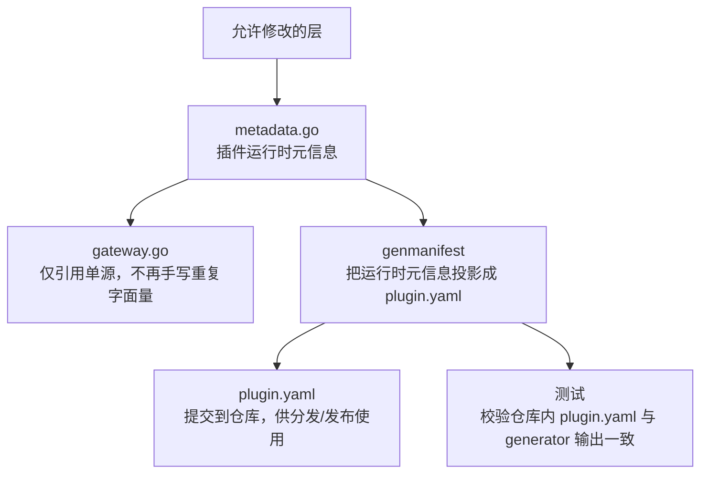

| 层 | 规则 |
| --- | --- |
| `airgate-sdk` | 只补字段语义和职责注释，不在本轮引入新协议字段 |
| 插件运行时 | 统一从单源元信息构造 `Info / Platform / Routes` |
| 插件分发 | `plugin.yaml` 必须由 generator 生成，不再手工维护 |
| 防漂移机制 | 至少保留 1 个测试，校验 `plugin.yaml` 与 generator 输出完全一致 |
